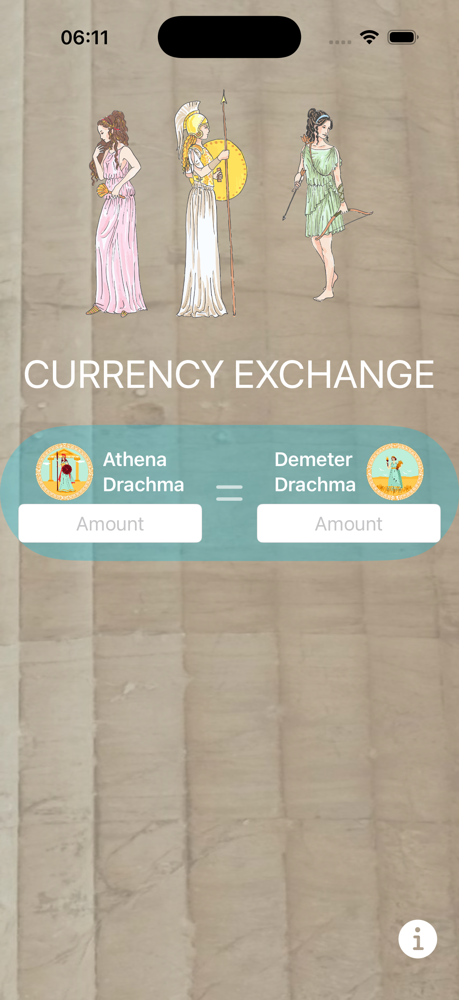
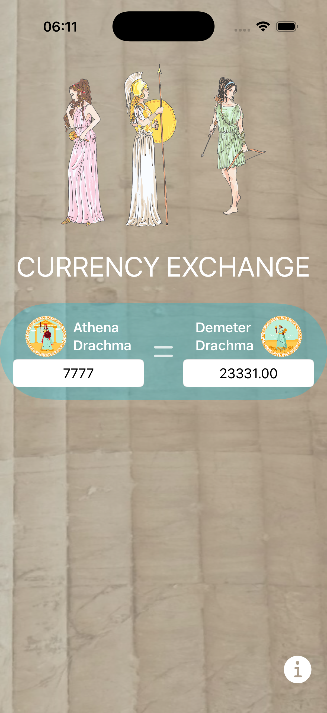
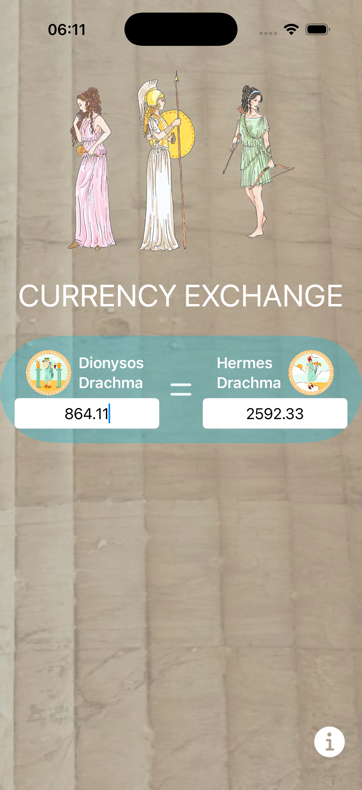

# Mythology Currency Converter

A mythology-inspired iOS currency converter built with SwiftUI.
This app allows users to convert between fictional currencies named after mythological gods.

## Overview
The goal of this project was to practice modern iOS development using SwiftUI
while building a clean, simple, and themed mobile application.
The original idea was adapted and redesigned with a mythology-based concept,
including custom currency names and UI text.

## Features
- SwiftUI-based navigation and screen flow
- Conversion between four mythological currencies
- Clean and intuitive user interface
- Simple and readable conversion logic

## Screenshots

  
  
  

## Built With
- Swift
- SwiftUI
- Xcode

## About the Project
This project was built as a personal learning exercise focused on understanding
SwiftUI fundamentals, view composition, and state-driven UI.
The app was customized beyond the original tutorial concept to reflect a
mythology-inspired theme and creative design choices.

## Credits
Inspired by a Udemy course by **Kenneth Jones**.
This project was adapted and extended as part of my iOS learning journey.

